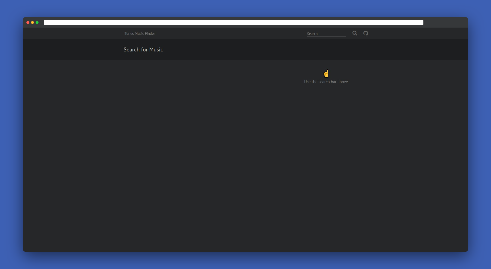
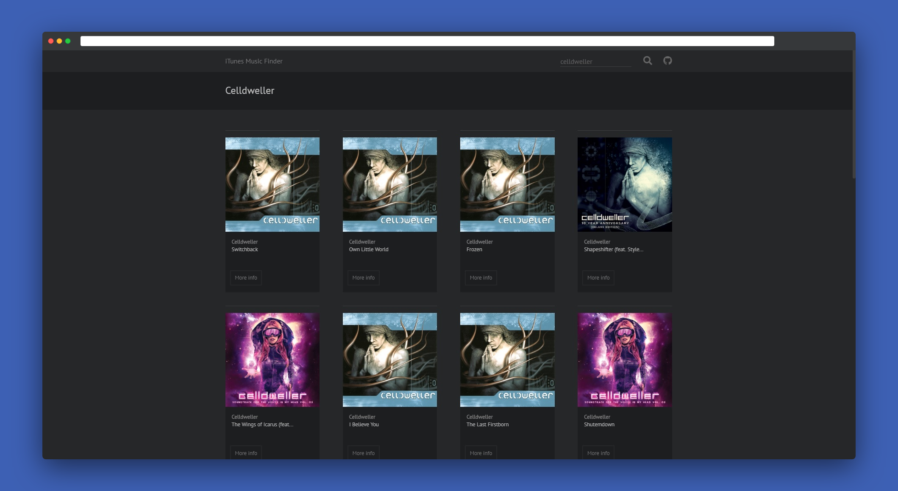
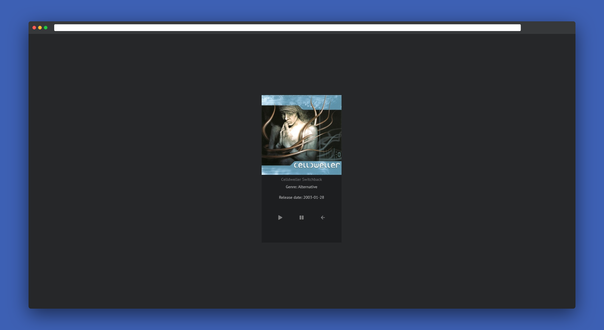

# iTunes Music Finder

## [Check live demo!](https://itunes-music-finder-mf.netlify.com/)

This is an iTunes music finder application made with ReactJS using the iTunes API. The app lists songs depending on your search terms. 

## How to Use

Use the search bar to enter a song name then hit Enter or click the search icon to submit your request. The app returns data depending on your input. You can click on the listed songs More Info button to see a detailed page and play a sample. Use the back arrow if you wish to leave the detailed page.

## Built With

- React JS
- React Router
- iTunes API
- SCSS
- Bootstrap 4
